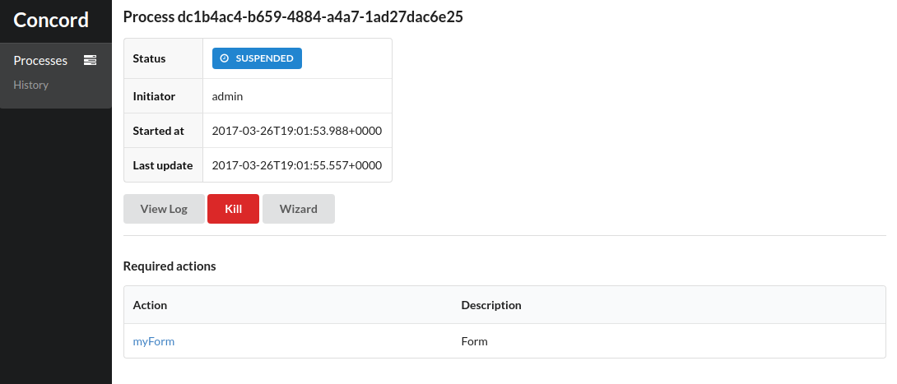

# Forms

Example of using forms in processes.

## Running

1. start the process

   ```
   cd docs/examples/forms
   ./run.sh localhost:8001
   ```
   
2. open [the console](http://localhost:8080):

   
   
3. open the process page:

   
   
4. start the wizard:

   
   
5. fill-out the form and click "Submit";

6. check the process logs: there should be "Hello, John Smith" message:

   
