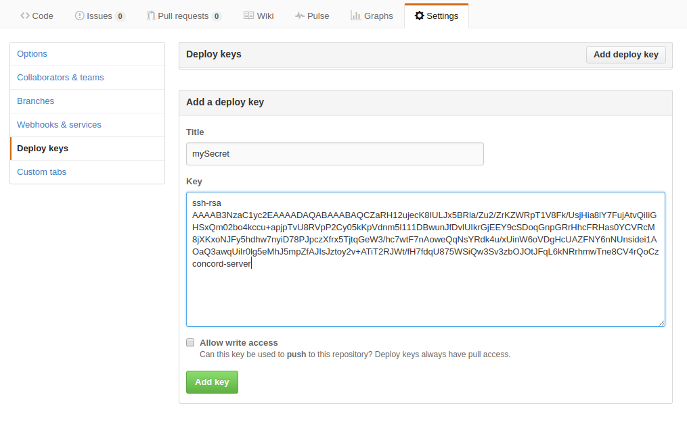

# Security

- [Managing credentials](#managing-credentials)
  - [GIT: SSH keys](#git-ssh-keys)
    - [Generating a new key pair](#generating-a-new-key-pair)
    - [Uploading an existing key pair](#uploading-an-existing-key-pair)
  - [GIT: username and password](#git-username-and-password)
- [Permissions](#permissions)

## Managing credentials

### GIT: SSH keys

#### Generating a new key pair

To generate a new SSH key pair:

```
curl -v \
-X POST \
-H "Authorization: auBy4eDWrKWsyhiDp3AQiw" \
'http://localhost:8001/api/v1/secret/keypair?name=mySecret'
```

The response will look like this:

```json
{
  "id" : "ef61edeb-2455-444d-bafd-e369601cf26c",
  "name" : "mySecret",
  "publicKey" : "ssh-rsa AAAA... concord-server",
  "ok" : true
}
```

The `publicKey` value must be added to the git repository's settings.
E.g. for GitHub: 

#### Uploading an existing key pair

The request:

```
curl -v \
-H "Authorization: auBy4eDWrKWsyhiDp3AQiw" \
-F public=@/path/to/public_key \
-F private=@/path/to/private_key \
'http://localhost:8001/api/v1/secret/keypair?name=mySecret'
```

The response:

```json
{
  "id" : "f746dd64-58da-4384-9b80-ce355d5ba881",
  "ok" : true
}
```

### GIT: username and password

To add username/password credentials:

```
curl -v \
-H "Content-Type: application/json" \
-H "Authorization: auBy4eDWrKWsyhiDp3AQiw" \
-d '{ "username": "luigi", "password": "imnotagreenmario" }' \
http://localhost:8001/api/v1/secret/password?name=mySecret
```

The response:
```json
{
  "id" : "f71c27f9-60e9-4d46-8437-bd5cfcec9ff6",
  "ok" : true
}
```

## Permissions

### Core

| Wildcard                  | Description                                                    | Examples                               |
|---------------------------|----------------------------------------------------------------|----------------------------------------|
| `apikey:create`           | Create a new API key.                                          |                                        |
| `apikey:delete`           | Delete any API key.                                            |                                        |
| `process:start:*`         | Starting a process from the specific project.                  | `process:start:*`, `process:start:ABC` |
| `project:create`          | Create a new project.                                          |                                        |
| `project:read:*`          | Read an existing project.                                      |                                        |
| `project:update:*`        | Update (modify) a project. E.g. add a repository to a project. | `project:update:ABC`                   |
| `repository:create`       | Create a new repository.                                       |                                        |
| `repository:delete:*`     | Delete specific repository.                                    |                                        |
| `repository:update:*`     | Update specific repository.                                    |                                        |
| `secret:create`           | Create a new secret.                                           |                                        |
| `secret:delete:*`         | Delete specific secret.                                        |                                        |
| `secret:read:*`           | Read an existing secret's data.                                |                                        |
| `template:create`         | Create a new project template.                                 |                                        |
| `template:delete:*`       | Delete specific template.                                      |                                        |
| `template:update:*`       | Update specific template.                                      |                                        |
| `template:use:*`          | Use a specific template.                                       | `template:use:ansible`                 |
| `user:create`             | Create a new user.                                             |                                        |
| `user:delete`             | Delete any user.                                               |                                        |
| `user:update`             | Update any user.                                               |                                        |
