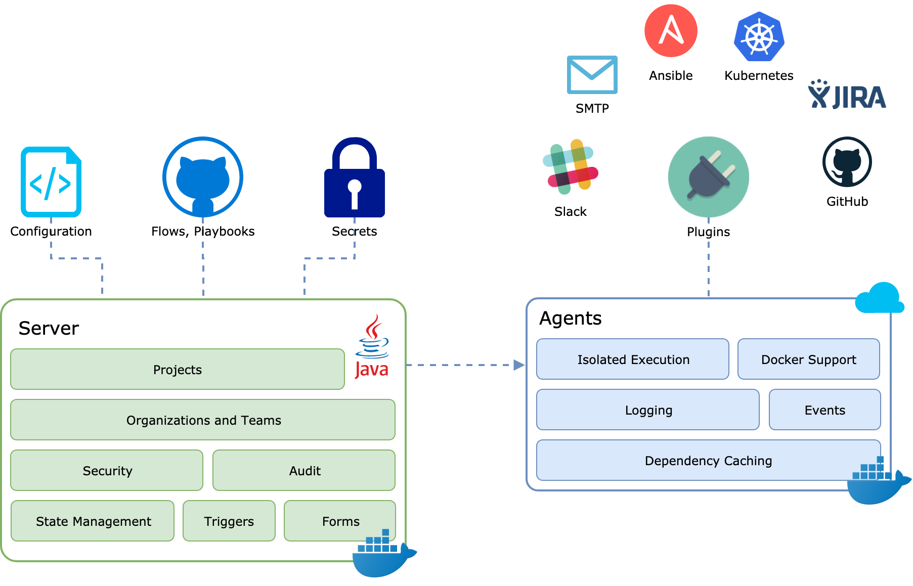

# Overview

# Main Concepts

Concord is a workflow server.  It is the orchestration engine that connects
different systems together using scenarios and plugins created by users.

Check out [the overview document](../../overview/index.md) for more
information about features and benefits of Concord.

## Processes

Processes are the main concept of Concord. A process is an execution of
[Concord Flows](../processes-v2/flows.md) in an isolated environment.

A process can run in a [project](#projects), thus sharing configuration and
resources (such as [the KV store]({{ site.concord_plugins_v2_docs }}/key-value.md)) with other
processes in the same project.

Processes can be suspended (typically using a [form](./forms.md)) and resumed.
While suspended processes are not consuming any resources apart from the DB
disk space. See the [Process Overview](../processes-v2/index.md) section for
more details about the lifecycle of Concord processes.

## Projects

A project is a way to group up processes and use shared environment and
configuration.

## Secrets

Concord provides an API and [the plugin]({{ site.concord_plugins_v2_docs }}/crypto.md) to work with
secrets such as:
- SSH keys;
- username/password pairs;
- single value secrets (e.g. API tokens);
- binary data (files)

Secrets can optionally be protected by a user-provided password.

## Users and Teams

Concord can use an Active Directory/LDAP server or the local user store
for authentication. Team-based authorization can be used to secure various
resources. 

## Organizations

Organizations are essentially namespaces to which resources such as projects,
secrets, teams and others belong to. 

# Components

[Concord](../../overview/index.md) consists of several components. The four
main components are:
- [Server](#concord-server) - the central component, manages the process state
and resources;
- [Console](#concord-console) - provides UI for project and process management,
etc;
- [Agent](#concord-agent) - executes user processes;
- [Database](#database) - stores the process state, all Concord entities, logs,
etc.

## Concord Server

The Server is the central component. It provides [the API](../api/index.md) which
is used to control processes, manage entities such as projects and secrets,
etc.

A minimal Concord installation contains at least one Server. Multiple servers
can run in active-active or active-passive configurations.

## Concord Console

The Console provides user interface for managing processes, projects, secrets and
other entities.

Read more about the console [here](../console/index.md).

## Concord Agent

The Agent is responsible for process execution. It receives workload from
[Server](#concord-server) and, depending on the configuration of the job,
starts processes in separate JVMs and/or Docker containers.

Depending on [the configuration](./configuration.md#agent-cfg-file) a single
agent can execute one or many jobs simultaneously.

A single Concord installation can have hundreds of Agents. It is also possible
to have Agents with different capabilities (e.g. running on different hardware)
connected to the single Concord instance. Which is useful when you need to run
some resource-intensive processes such as Ansible with lots of `forks`.

## Database

Concord uses [PostgreSQL](https://www.postgresql.org/) (10.4 or higher) to
store process state, logs and entities such as projects and secrets.
