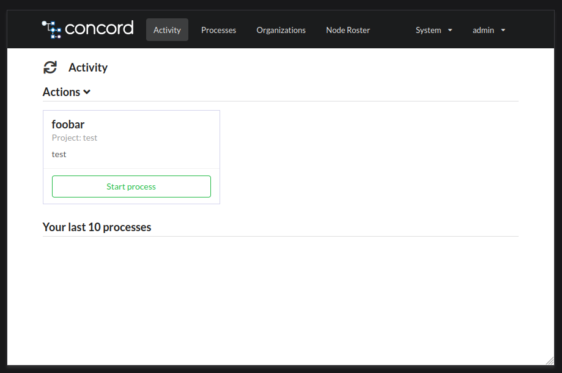
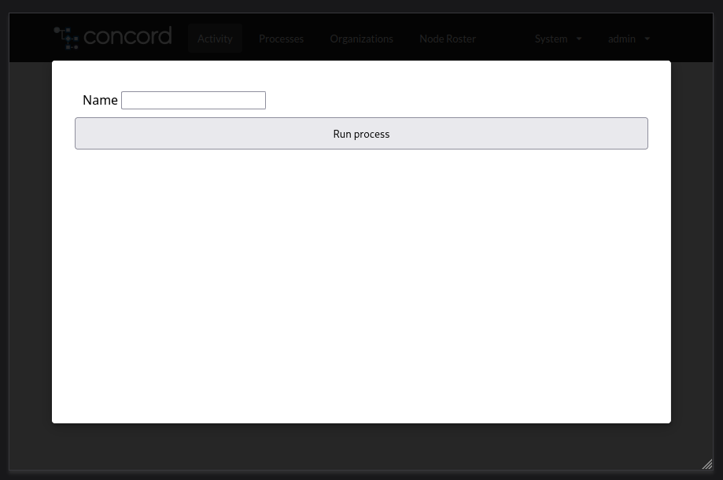

# Process Cards

"Process Cards" are a little tiles on the Activity page of the Concord UI.
They can be used to start a predefined process with no parameters or to show a "form".
The form is a static HTML page that will be displayed when user clicks on the card.
The page can contain any HTML, CSS, and JavaScript code.

This particular example demonstrates how to use [HTMX](https://htmx.org/) to
implement a custom form to start a process.

Steps:
- create a new Concord project and register the Git repository with the flow
  you want to run;
- upload the form by calling the API (while in this directory):
  ```
  curl -i \
  -H 'Authorization: yourApiKey' \
  -F org=myOrg \
  -F project=myProject \
  -F repo=myRepo \
  -F entryPoint=myFlow \
  -F name=foobar \
  -F description=Test \
  -F form=@index.html \
  http://localhost:8001/api/v1/processcard
  ```
- log into the Concord UI and check the Activity page:
  
- click on "Start process" and you should see the form:
  

The uploaded [index.html](index.html) file contains a simple form with a single input field.
When the form is submitted, the `htmx:post` attribute triggers a POST request to the
`/api/v1/process` endpoint with the form data.
